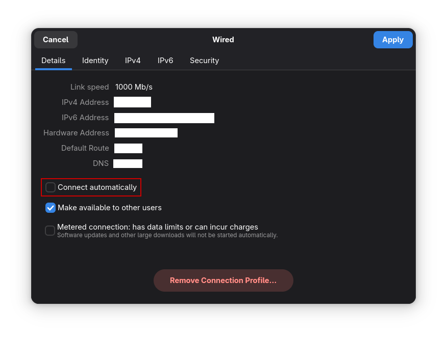
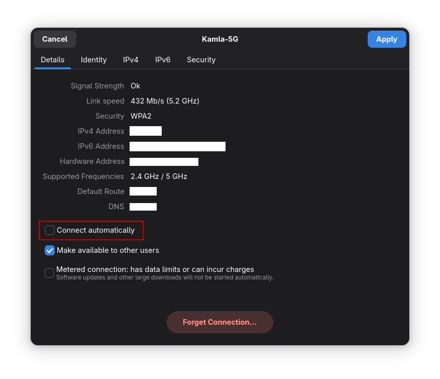

# network_manager_startup_fix_linux

For some reason, NetworkManager has a bug where it can't connect to Ethernet or Wi-Fi automatically. 
I have this issue on Fedora. This is a workaround to resolving this issue.

## The Workaround

### Ethernet Setup

For Gnome, go to Settings -> Network. Click on the gear of the Wired connection. 
Make sure that "Connect automatically" is unchecked.



Copy the Ethernet startup script to `~/.local/bin`
```
cp ethernet_startup.sh ~/.local/bin/ethernet_startup.sh
```

Add this line to the file, `~/.bash_profile`
```
echo "~/.local/bin/ethernet_startup.sh" >> ~/.bash_profile
```

Reboot the PC and your Ethernet connection should work automatically.

### Wi-Fi Setup

For Gnome, go to Settings -> Wi-Fi. Click on the gear of the chosen Wi-Fi network. 
Make sure that "Connect automatically" is unchecked.



Get the SSID of your Wi-Fi
```
nmcli device wifi list
```

Change the ssid variable to the SSID of your Wi-Fi in the `wifi_startup.sh` script.

Copy the Wi-Fi startup script to `~/.local/bin`
```
cp wifi_startup.sh ~/.local/bin/wifi_startup.sh
```

Add this line to the file, `~/.bash_profile`
```
echo "~/.local/bin/wifi_startup.sh" >> ~/.bash_profile
```

Reboot the PC and your Wi-Fi connection should work automatically.
